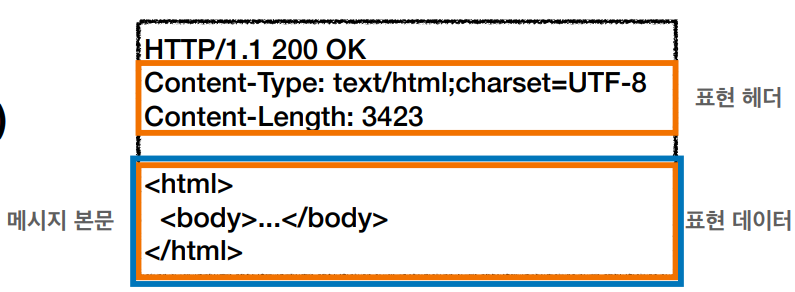
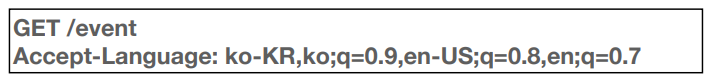

### HTTP 헤더

- header-field = field-name":" OWS field-value OWS (OWS: 띄어쓰기 허용)
- field-name은 대소문자 구문 없음
  

---

### HTTP 헤더 용도

- HTTP 전송에 필요한 모든 부가정보
- 예) 메시지 바디의 내용, 메시지 바디의 크기, 압축, 인증, 요청 클라이언트, 서버 정보...
- 표준 헤더가 너무 많음
  - https://en.wikipedia.org/wiki/List_of_HTTP_header_fields
- 필요시 임의의 헤더 추가 가능
  - helloworld: hihi

---

### HTTP 헤더 분류 - RFC2616(과거)

- 헤더 분류
  - General 헤더: 메시지 전체에 적용되는 정보, 예) Connection: close
  - Request 헤더: 요청 정보, 예) User-Agent: Mozilla/5.0 (Macintosh; ..)
  - Response 헤더: 응답 정보, 예) Server: Apache
  - Entity 헤더: 엔티티 바디 정보, 예) Content-Type: text/html, Content-Length: 3423

---

### HTTP BODY message body - RFC2616 (과거)

- 메시지 본문(message body)은 엔티티 본문(entity body)을 전달하는데 사용
- 엔티티 본문은 요청이나 응답에서 전달할 실제 데이터
- 엔티티 헤더는 엔티티 본문의 데이터를 해석할 수 있는 정보 제공
  - 데이터 유형(html, json), 데이터 길이, 압축 정보 등등

---

### RFC723x 변화

HTTP 표준 -> 1999년 RFC2616 (폐기됨) -> 2014년 RFC7230~7235 등장

- 엔티티(Entity) -> 표현(Representation)
- Representation = Representation Metadata + Representation Data
- 표현 = 표현 메타데이터 + 표현 데이터

---

### HTTP BODY message body - RFC7230 (최신)

- 메시지 본문을 통해 표현 데이터 전달
- 메시지 본문 = 페이로드
- 표현은 요청이나 응답에서 전달할 실제 데이터
- 표현 헤더는 표현 데이터를 해석할 수 있는 정보 제공
  - 데이터 유형(html, json), 데이터 길이, 압축 정보 등등
- 참고: 표현 헤더는 표현 메타데이터와, 페이로드 메시지를 구분해야 하지만, 여기서는 생략

---

### 표현

- Content-Type: 표현 데이터의 형식
- Content-Encoding: 표현 데이터의 압축 방식
- Content-Language: 표현 데이터의 자연 언어
- Content-Length: 표현 데이터의 길이
- 표현 헤더는 전송, 응답 둘다 사용

---

### Content-Type 표현 데이터의 형식 설명

- 미디어 타입, 문자 인코딩
- 예)
  - text/html; charset=utf-8
  - application/json
  - image/png

---

### Content-Encoding 표현 데이터 인코딩

- 표현 데이터를 압축하기 위해 사용
- 데이터를 전달하는 곳에서 압축 후 인코딩 헤더 추가
- 데이터를 읽는 쪽에서 인코딩 헤더의 정보로 압축 해제
- 예)
  - gzip
  - deflate
  - identity - 압축 안함

---

### Content-Language 표현 데이터의 자연 언어

- 표현 데이터의 자연 언어를 표현
- 예)
  - ko
  - en
  - en-US

---

### Content-Length 표현 데이터의 길이

- 바이트 단위
- Transfer-Encoding(전송 코딩)을 사용하면 Content-Length를 사용하면 안됨

---

### 협상(콘텐츠 네고시에이션) 클라이언트가 선호하는 표현 요청

- Accept: 클라이언트가 선호하는 미디어 타입 전달
- Accept-Charset: 클라이언트가 선호하는 문자 인코딩
- Accept-Encoding: 클라이언트가 선호하는 압축 인코딩
- Accept-Language: 클라이언트가 선호하는 자연 언어
- 협상 헤더는 요청시에만 사용

---

### 협상과 우선순위1 Quality Values(q)

- Qualtity Values(q) 값 사용
- 0~1, 클수록 높은 우선순위
- 생략하면 1
- Accept-Language: ko-KR,ko;q=0.9,en-US;q=0.8,en;q=0.7
  - 1. ko-KR;q=1(생략)
  - 2. ko;q=0.9
  - 3. en-US;q=0.8
  - 4. en;q=0.7

---

### 협상과 우선순위2 Quality Values(q)

- 구체적인 것이 우선한다.
- Accept: text/\*,text/plain,text/plain;format=flowed,\*/\*
  - 1. text/plain;format=flowed
  - 2. text/plain
  - 3. text/\*
  - 4. \*/\*

---

### 협상과 우선순위3 Quality Values(q) - 잘 안쓰임

- 구체적인 것을 기준으로 미디어 타입을 맞춘다.
- Accept:text/\*;q=0.3,text/html;q=0.7,text/html;level=1,text/html;level=2;q=0.4,\*/\*;q=0.5
  

---

### 일반 정보

- From: 유저 에이전트의 이메일 정보
- Referer: 이전 웹 페이지 주소
- User-Agent: 유저 에이전트 애플리케이션 정보
- Server: 요청을 처리하는 오리진 서버의 소프트웨어 정보
  - 오리진 서버: 실제로 데이터를 처리하는 마지막 서버
- Date: 메시지가 생성된 날짜

---

### From (유저 에이전트의 이메일 정보)

- 일반적으로 잘 사용되지 않음
- 검색 엔진 같은 곳에서, 주로 사용
- 요청에서 사용

---

### Referer (이전 웹 페이지 주소)

- 현재 요청된 페이지의 이전 웹 페이지 주소
- A -> B로 이동하는 경우 B를 요청할 때 Refer: A를 포함해서 요청
- Referer를 사용해서 유입 경로 분석 가능
- 요청에서 사용
- 참고: referer는 단어 referrer의 오타 (고치면 많은 혼돈이 오니 그냥 사용)

---
