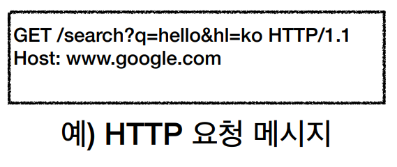
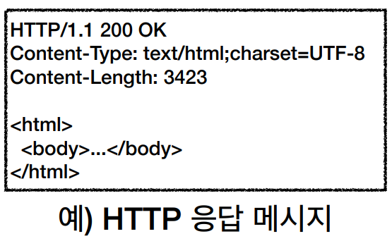
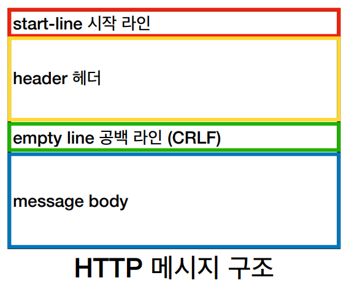
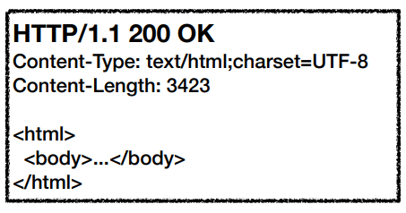
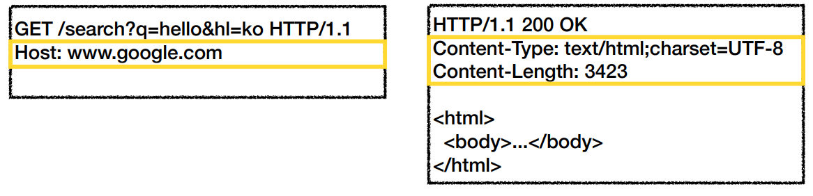
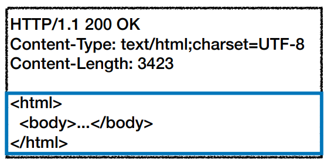

## HTTP (HyperText Transfer Protocol)

### 모든 것이 HTTP <HTTP 메시지에 모든 것을 전송>

- html, text
- image, 음성, 영상, 파일
- JSON, XML (API)
- 심지어 서버간 데이터를 주고 받을 때
- 바야흐로 지금은 HTTP 시대

---

### HTTP 역사

- HTTP/0.9 1991년: GET 메서드만 지원, HTTP 헤더 X
- HTTP/1.0 1996년: 메서드, 헤더 추가
- HTTP/1.1 1997년: 가장 많이 사용, 우리에게 가장 중요한 버전
  - RFC2068 (1997) -> **RFC2616 (1999)** -> RFC7230 ~ 7235 (2014)
- HTTP/2 2015년: 성능 개선
- HTTP/3 진행중: TCP 대신 UDP 사용, 성능 개선

---

### 기본 프로토콜

- TCP: HTTP/1.1, HTTP/2
- UDP: HTTP/3
- 현재 HTTP/1.1 주로 사용
  - HTTP/2, HTTP/3도 점점 증가하는 추세

---

### HTTP 특징 - 클라이언트 서버 구조

- Request, Response 구조
- 클라이언트는 서버에 요청을 보내고, 응답을 대기
- 서버가 요청에 대한 결과를 만들어서 응답
- 클라이언트는 UI, UX에만 집중 / 서버는 비즈니스 로직에만 집중하면 됨
  - 즉, 독립적으로 진화할 수 있음

---

### 무상태 프로토콜 (Stateless)

- 서버가 클라이언트의 상태를 보존X
- 장점: 서버 확장성 높음(스케일 아웃)
- 단점: 클라이언트가 추가 데이터 전송
-

### Stateful, Stateless 차이 정리

- **상태유지**: 중간에 다른 서버(점원)으로 바뀌면 안된다.
  - (중간에 다른 서버(점원)으로 바뀔 때 상태 정보를 다른 서버(점원)에게 미리 알려줘야 한다.)
- **무상태**: 중간에 다른 서버로 변경되어도 된다.
  - 갑자기 클라이언트가 증가해도 서버를 대거 투입할 수 있다.
- 무상태는 응답 서버를 쉽게 바꿀 수 있다. -> **무한한 서버 증설 가능** (스케일 아웃)

---

### Stateless 실무 한계

- 모든 것을 무상태로 설게 할 수 있는 경우도 있고 없는 경우도 있다.
- 무상태
  - 예) 로그인이 필요 없는 단순한 서비스 소개 화면
- 상태유지
  - 예) 로그인
- 로그인한 사용자의 경우 로그인 했다는 상태를 서버에 유지
- 일반적으로 브라우저 쿠키와 서버 세션 등을 사용해서 상태유지
- 상태유지를 아예 쓰지 않을 수는 없음, 상태유지는 최소한으로 사용

---

### 비연결성

- HTTP는 기본이 연결을 유지하지 않는 모델
- 일반적으로 초 단위 이하의 빠른 속도로 응답
- 1시간 동안 수천명이 서비스를 사용해도 실제 서버에서 동시에 처리하는 요청은 수십개 이하로 매우 작음
  - 예) 웹 브라우저에서 계속 연속으로 검색 버튼을 누르지 않음
- 서버 자원을 매우 효율적으로 사용할 수 있음

---

### 비연결성 한계와 극복

- TCP/IP 연결을 새로 맺어야 함 -> 3 way handshake 시간 추가
- 웹 브라우저로 사이트를 요청하면 HTML 뿐만 아니라 JS, CSS, 추가 이미지 등 수많은 자원이 함께 다운로드
- 지금은 HTTP 지속 연결(Persistent Connections)로 문제 해결
- HTTP/2, HTTP/3에서 더 많은 최적화

---

### HTTP 메시지

- 공백은 반드시 들어가야 함

---

### 시작 라인 (요청 메시지)

- HTTP 메서드 (GET: 조회)
  - 종류: GET, POST, PUT, DELETE ...
  - 서버가 수행해야 할 동작 지정
    - GET: 리소스 조회
    - POST: 요청 내역 처리
- 요청 대상 (/search?q=hello&hl=ko)
  - absolute-path[?uqery] (절대경로[?쿼리])
  - 절대경로="/"로 시작하는 경로
- HTTP Version

---

### 시작 라인 (응답 메시지)

- HTTP 버전
- HTTP 상태 코드: 요청 성공, 실패를 나타냄
  - 200: 성공
  - 400: 클라이언트 요청 오류
  - 500: 서버 내부 오류
- 이유 문구: 사람이 이해할 수 있는 짧은 상태 코드 설명 글

---

### HTTP 헤더

- header-field = field-name ":" OWS field-value OWS (OWS: 띄어쓰기 허용)
- field-name은 대소문자 구문 없음

---

### HTTP 헤더 용도

- HTTP 전송에 필요한 모든 부가정보
  - 예) 메시지 바디의 내용, 메시지 바디 크기, 압축, 인증, 요청 클라이언트 정보 ...
- 표준 헤더가 너무 많다.
  - https://en.wikipedia.org/wiki/List_of_HTTP_header_fields
- 필요시 임의의 헤더 추가 가능
  - 약속된 클라이언트랑 데이터를 주고 받아야겠지만

---

### HTTP 메시지 바디 용도

- 실제 전송할 데이터
- HTML 문서, 이미지, 영상, JSON 등등 byte로 표현할 수 있는 모든 데이터 전송 가능

---

### 단순함 확장 가능

- HTTP는 단순하다. 스펙도 음... 읽어볼만 하다 (아마도)
- HTTP 메시지도 매우 단순 (머리, 가슴, 배 얼마나 좋아)
- 크게 성공하는 표준 기술은 단순하지만 확장 가능한 기술

---
